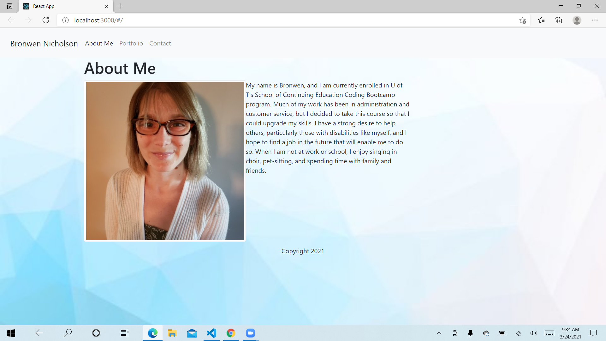

# React Portfolio

  An updated version of my original portfolio using React

  # Table of Contents:
  *[Installation](#installation)
  *[Usage](#usage)
  *[Test](#test)
  *[Contributions](#contributions)
  *[Questions](#questions)
  *[License](#license)
  
  
  ## Installation 
  
  React is required
  
  ## Usage
  
 When you first go to the website, the first page you see is an About Me page, featuring a short bio of myself.  The next page is a portfolio page, featuring my contact info, resume, links to my LinkedIn and GitHub profiles, and selected projects.

 ## Test

 By running it to make sure it works
  
  ## Contributions
  
  Individual assignment

  ## License
  
  None

  Screenshot: 

  https://github.com/bnicholson87/ReactPortfolioBronwen.git
  https://reactportfolio-bn.herokuapp.com/#/
